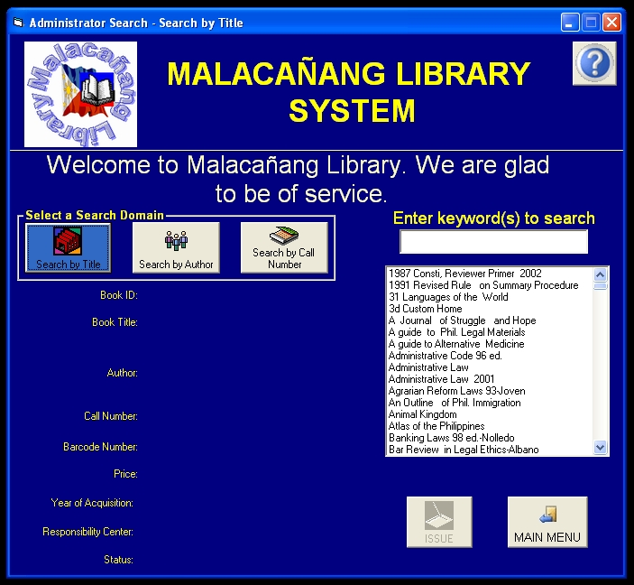



## Library System \(MLS\) Complete

### Description

It is a complete library system, add, edit, delete patrons, administrator and books, it is a complete package and 100% working
 
### More Info
 
admin user:admin pass:admin

patron user:patron pass:patron

vote for me if you like the program or post any comments,,,

             |
---                |---
**Submitted On**   |2006-03-14 23:28:58
**By**             |[Reynard Laurence P\. Tan](https://github.com/Planet-Source-Code/PSCIndex/blob/master/ByAuthor/reynard-laurence-p-tan.md)
**Level**          |Beginner
**User Rating**    |5.0 (10 globes from 2 users)
**Compatibility**  |VB 4\.0 \(16\-bit\), VB 4\.0 \(32\-bit\), VB 5\.0, VB 6\.0, VBA MS Access
**Category**       |[Databases/ Data Access/ DAO/ ADO](https://github.com/Planet-Source-Code/PSCIndex/blob/master/ByCategory/databases-data-access-dao-ado__1-6.md)
**World**          |[Visual Basic](https://github.com/Planet-Source-Code/PSCIndex/blob/master/ByWorld/visual-basic.md)
**Archive File**   |[Library\_Sy1986384112006\.zip](https://github.com/Planet-Source-Code/reynard-laurence-p-tan-library-system-mls-complete__1-64985/archive/master.zip)

